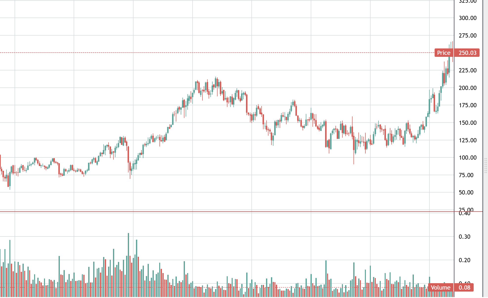
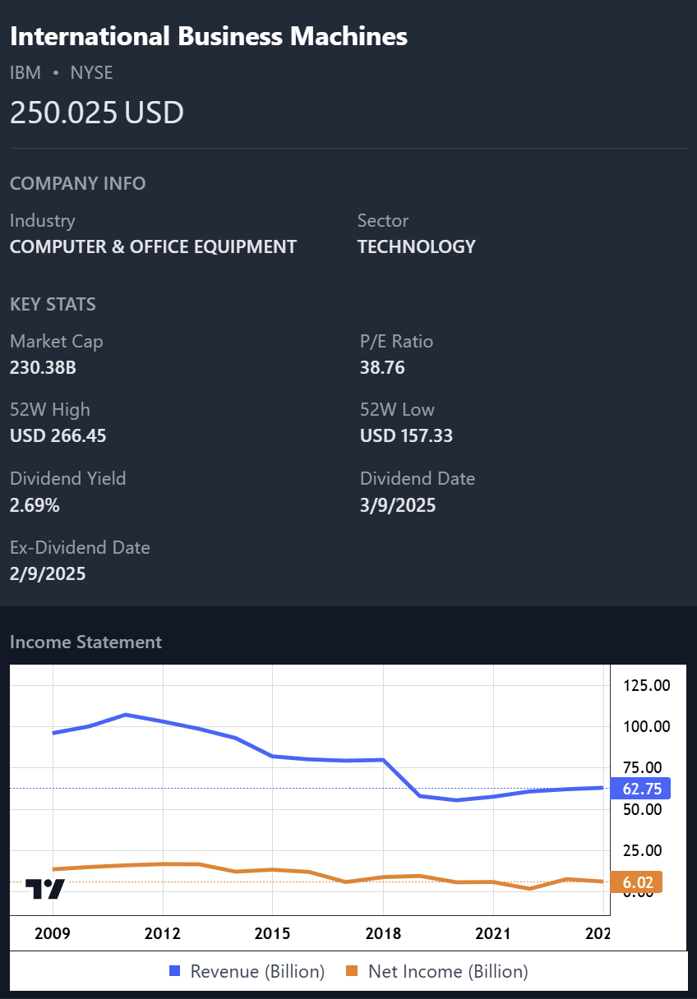
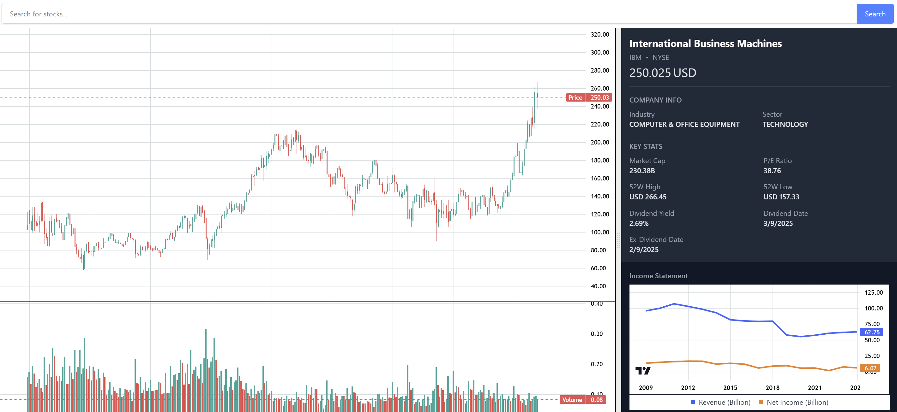

# DataViz
A Single page application that fetches stock related data from [AlphaVantage API](https://www.alphavantage.co/) and renders it in resizable panels. Numerical data is represented as charts using [Lightweight charts](https://tradingview.github.io/lightweight-charts/docs) for better visualization.

This project was generated using [Angular CLI](https://github.com/angular/angular-cli) version 19.1.7.


## Setup
1. Clone this repo to your local using `git clone https://github.com/siddhanth339/DataViz.git`
2. Create a folder to store api url and keys in src/environments/environment.ts
3. Example for environment.ts file:
```bash
export const environment = {
  production: false,
  apiKey: 'XXXXXXXX',
  apiUrl: 'https://www.alphavantage.co/query?function=OVERVIEW&symbol=',
  symbolApiUrl: 'https://www.alphavantage.co/query?function=SYMBOL_SEARCH&keywords=',
  incomeStmtAPIUrl: 'https://www.alphavantage.co/query?function=INCOME_STATEMENT&symbol=',
  stockPriceUrl: 'https://www.alphavantage.co/query?function=TIME_SERIES_MONTHLY&symbol='
};
```
4. Get your free api key from [API Key](https://www.alphavantage.co/support/#api-key) and replace the apiKey value above.
## Development server

To start a local development server, run:

```bash
npm start
```

Once the server is running, open your browser and navigate to `http://localhost:4200/`. The application will automatically reload whenever you modify any of the source files.

## Screenshots:







